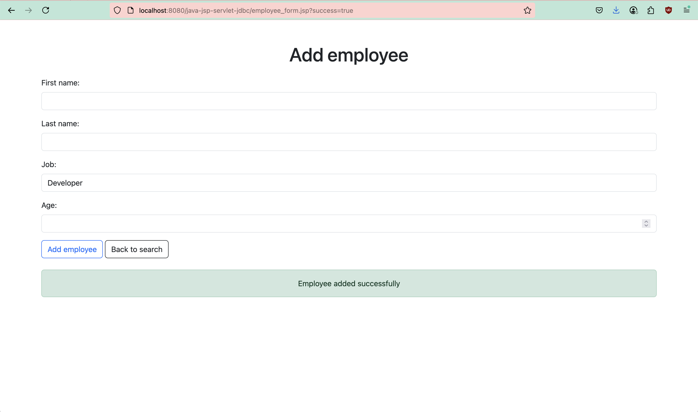

## Employee Management Java Web App

A simple Java web application to add and search employees using JSP, Servlets, JDBC, MySQL and CSS/Bootstrap

### 1. The project was implemented with the following setup

- Java version: `17.0.11 2024-04-16 LTS`
- Installed via Homebrew
	- Maven: `3.9.10`
	- MySQL: `9.3.0`
	- MySQL Workbench: `8.0.42` (cask)
	- Tomcat: `11.0.8`
	- Eclipse JEE IDE: `4.36.0` (cask)

### 2. How Maven Project Was Created & Run

#### 📦 Project Creation

The project was created using Eclipse IDE Maven project wizard. The archetype selected was
- Group Id: org.apache.maven.archetypes
- Artifact Id: maven-archetype-webapp
- Version 1.5

Also added `mysql-connector-j` dependency to pom.xml

#### ▶️ Running the App

Steps needed to run the App
- While in Eclipse Java EE perspective, switch to Servers tab. Create a new server -> Select Apache Tomcat v11.0 -> Set installation directory path to `/opt/homebrew/Cellar/tomcat/11.0.8/libexec` -> Click finish
- `Tomcat v11.0 Server` should now be visible in Servers tab. Right click and Start
- Right click on the project -> Properties -> Targeted Runtimes -> Check `Apache Tomcat v11.0` -> Click apply and close
- Right click on the project again -> Run as -> Run on server -> Select `Tomcat v11.0 Server` -> Finish. This should launch the app and open the index.jsp file of the project (url `http://localhost:8080/java-jsp-servlet-jdbc`)

### 3. Tech Stack
| Layer        | Technology Used |
| ------------ | --------------- |
| View         | JSP, HTML, CSS  |
| Styling      | Bootstrap 5.3   |
| Controller   | Java Servlets   |
| Model        | POJOs           |
| Database     | MySQL           |
| Access       | JDBC            |
| Architecture | MVC             |

### 4. Screenshots of the Web App
<kbd></kbd>
<kbd></kbd>
<kbd></kbd>
<kbd></kbd>
<kbd></kbd>
<kbd></kbd>


### 5. Folder structure
```
java-jsp-servlet-jdbc/
├── src/main/java/
│   ├── com/learn/javaweb
│   │   ├── controller/
│   │   │   ├── AddEmployeeServlet.java
│   │   │   ├── GetEmployeesServlet.java
│   │   ├── dao/EmployeeDao.java
│   │   ├── model/Employee.java
│   │   ├── util/DBUtils.java
├── src/main/webapp/
│   ├── employee_form.jsp
│   └── index.jsp
├── sql/init_db.sql
├── pom.xml
├── README.md
└── screenshots/
```

